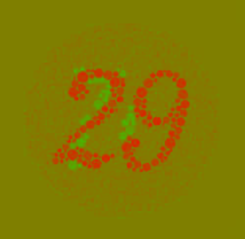
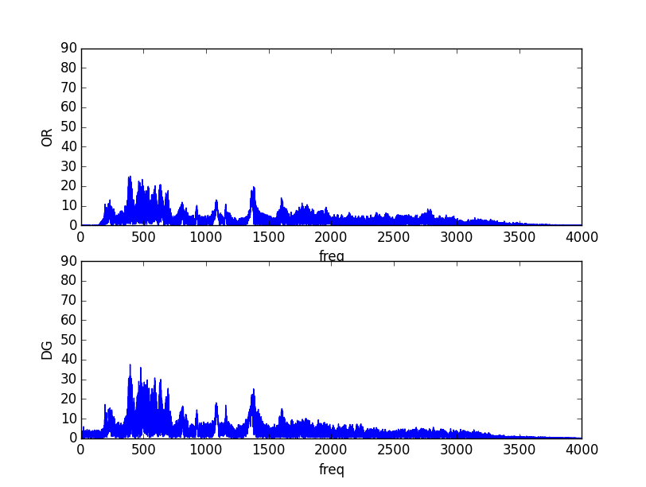
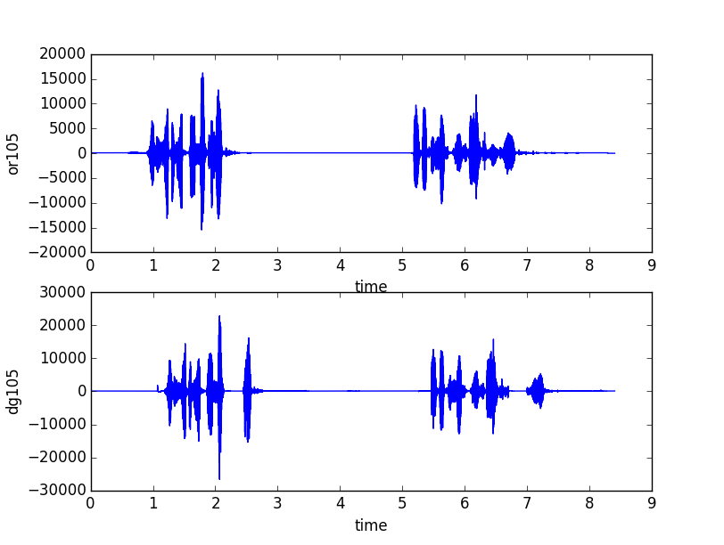
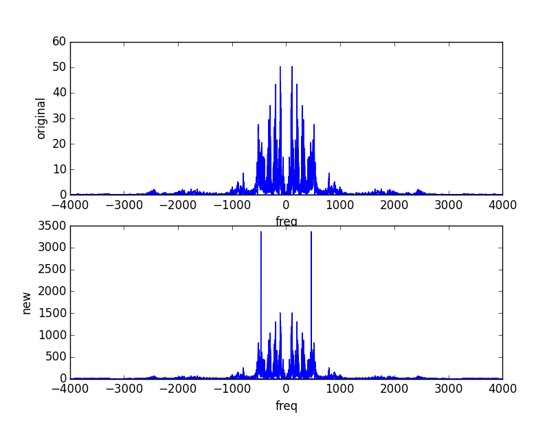

#Projeto PDS

Hélio de Meira Lins Neto

## Ferramentas

Todo o projeto foi feito usando ferramentas opensource. Seguem as ferramentas usadas:

* Python
* Pillow
* Numpy
* Scypy
* Matplotlib
* Tesseract-ocr ( pytesseract)
* Octave

##Parte 1

###Questão 1

Código: parte1/q1.py

Gráficos das letras **a)**, **b)** e **c)**. Todos feitos usando Numpy/Scipy.

#### **d)**
A função z tem o dobro da frequência da função y. Assim, a transformada de fourier Z(f)=Y(f/2) e
seus picos são em pontos com o dobro da frequência dos de y.
A transformada da função w, obtida a partir da concatenação das anteriores, possui os picos de Z
e de Y. Note que, graficamente, não é possível inferir quando as frequências estão ativas.

#### **e)**

As bibliotecas Numpy e Scipy não tem uma função pronta do espectograma. Para evitar implementá-la,
usei o GNU Octave. Seguem os comandos:

    pkg load signal
    t = [0:0.01:9.99];
    w = [sin(20*pi*t) + cos(30*pi*t), sin(40*pi*t) + cos(60 * pi * t)];
    specgram(w, 256, 100, 500)

Agora vemos as componentes de frequência pelo tempo, o que não era claro na transformada de fourier.
Isso acontece pois o espectrograma faz transformadas de fourier em subintervalos.

## Parte2

### Questão 1

Código: parte2/q1.py

A maneira mais simples de resolver o problema dos Ringings é aplicando um filtro passa baixa.
Apliquei um filtro gaussiano (do scipy) com sigma 1.5. Segue o resultado:

A desvantagem do filtro gaussiano é que ele embaça bastante a foto. Provavelmente, pode-se obter
um resultado melhor usando filtro sinc. fonte: [https://en.wikipedia.org/wiki/Ringing_artifacts#Causes](https://en.wikipedia.org/wiki/Ringing_artifacts#Causes)

### Questão 2

Código: parte2/q2.py
Parte mais relevante do código:

    text = pytesseract.image_to_string(img)
    without_spaces = re.sub('\s+', '', text)

    print(len(without_spaces))

Não obtive muito sucesso com meus algoritmos, então apelei para o Tesseract, que é uma ferramenta para reconhecer textos em imagens. Bastou apenas remover os espaços e os '\n' ( usei expressões regulares). Número de caracteres: 211.

TODO: explicar minhas tentativas

### Questão 3

Analisando as componentes RGB da imagem separadamente( e em tons de cinza), notei que o número fica evidente ao comparar
as imagens das componentes R e G ( passando de uma para outra, como em um slideshow). Comparar a componente azul com qualquer uma das outras duas não deixou o número evidente para mim.
Assim, decidi trocar as componentes vermelhas e verdes assim:

    cb[:, :, 0] = 255 / 2 + (dalton[:, :, 0] - dalton[:, :, 1])
    cb[:, :, 1] = 255 / 2 + (dalton[:, :, 1] - dalton[:, :, 0])

Resulta em:

É meio difícil explicar a motivação de tal transformação, mas devo dizer que foram várias tentativas até chegar
nesta, que deixa bem evidente a distinção. Também é possível obter resultados ainda melhores aumentado o fator que
multiplica a diferença das componentes R e G, ou deixando o vermelho mais claro e o verde mais escuro. Exemplo:

    cb[:, :, 0] = 3*255 / 4 + (dalton[:, :, 0] - dalton[:, :, 1])
    cb[:, :, 1] = 255 / 4 + (dalton[:, :, 1] - dalton[:, :, 0])

Retirando a cor azul da jogada:

## Parte 3

Código: parte3/parte3.py

Na parte 3, tomei a solução mais simples possível. Simplesmente:

    imsave('inter_102.bmp', img101 / 2 + img103 / 2)
    imsave('inter_110.bmp', img109 / 2 + img111 / 2)
    imsave('inter_118.bmp', img117 / 2 + img119 / 2)

Frames:

## Parte 4

### Questão 1

Código: parte4/q1.py

Analisamos os sinais nos domínios do tempo e da frequência:

Percebemos que há atrasos e perdas.

### Questão 2

Código: parte4/q2.py

Taxa de Amostragem: 8kHz

Primeiramente, removi o ruído zerando uma banda de frequência na transformada de fourier, e depois tirando a transformada inversa. Só pra checar mesmo.

Apliquei um Filtro Fir ( janela de kaiser, width=1/fs, ripple_db = 11). Os coeficientes foram divididos por 10000 para diminuir o ruído. O resultado foi bastante satisfatório. Brinquei com vários valores de filtros de Kaiser e obtive resultados satisfatórios. Não consegui obter bons resultados com filtros de Chebyshev.