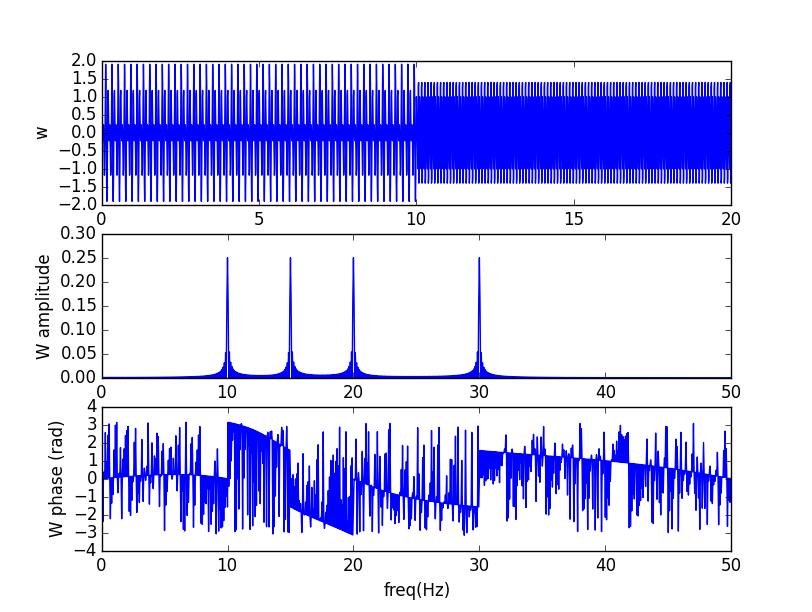

#Projeto PDS

Hélio de Meira Lins Neto

## Ferramentas

Todo o projeto foi feito usando ferramentas opensource. Seguem as ferramentas usadas:

* Python
* Pillow
* Numpy
* Scypy
* Matplotlib
* Tesseract-ocr
* Octave

##Parte 1

###Questão 1

Código: parte1/q1.py

Gráficos das letras **a)**, **b)** e **c)**. Todos feitos usando Numpy/Scipy.

#### **d)**
A função z tem o dobro da frequência da função y. Assim, a transformada de fourier Z(f)=Y(f/2) e
seus picos são em pontos com o dobro da frequência dos de y.
A transformada da função w, obtida a partir da concatenação das anteriores, possui os picos de Z
e de Y. Note que, graficamente, não é possível inferir quando as frequências estão ativas.

#### **e)**

As bibliotecas Numpy e Scipy não tem uma função pronta do espectograma. Para evitar implementá-la,
usei o GNU Octave. Seguem os comandos:

    pkg load signal
    t = [0:0.01:9.99];
    w = [sin(20*pi*t) + cos(30*pi*t), sin(40*pi*t) + cos(60 * pi * t)];
    specgram(w, 256, 100, 500)

Agora vemos as componentes de frequência pelo tempo, o que não era claro na transformada de fourier.
Isso acontece pois o espectrograma faz transformadas de fourier em subintervalos.

## Parte2

### Questão 1
A maneira mais simples de resolver o problema dos Ringings é aplicando um filtro passa baixa.
Apliquei um filtro gaussiano com sigma 1.5. Segue o resultado:

A desvantagem do filtro gaussiano é que ele embaça bastante a foto. Provavelmente, pode-se obter
um resultado melhor usando filtro sinc. fonte: [https://en.wikipedia.org/wiki/Ringing_artifacts#Causes](https://en.wikipedia.org/wiki/Ringing_artifacts#Causes)
